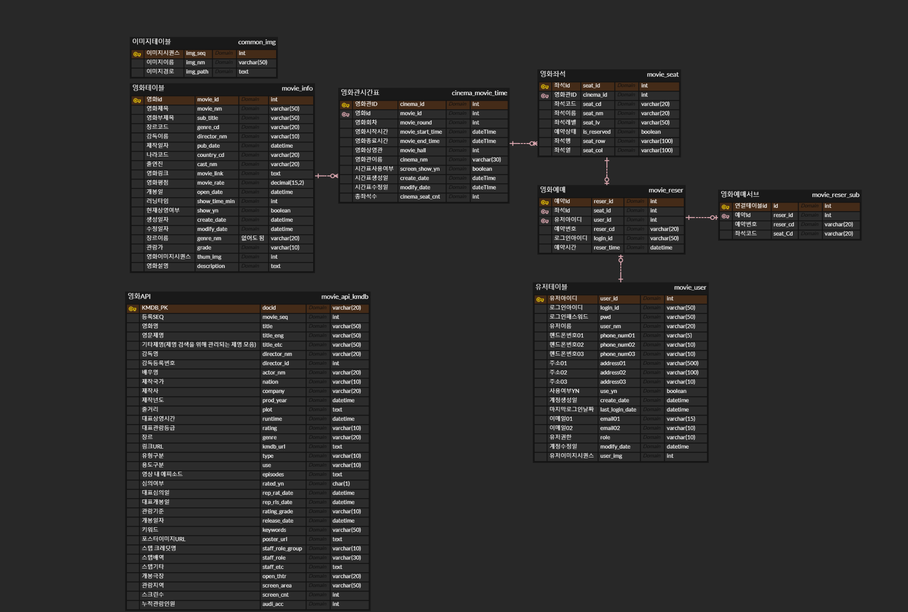

#### 멀티모듈 연습 ####
1. 모듈 생성 및 모듈 종속성 설정
2. 레이어드 아키텍쳐로 사용 (infrastructure, domain, service, presentation)
3. 각 모둘 설명
3-0. 이 프로젝트는 소형 프로젝트임(jar파일 처럼 여러 라이브러리 담고 기능하는 걸 생각하면 됨-> 그렇게 커짐)
   - 나중에 어플리케이션:서비스 나 프레젠테이션:컨트롤러 부분 모듈 나눌 수 있음
   - 사용할 라이브러리 및 framework
     - redis (설정완)
     - QueryDSL (설정완)
     - mocking
     - springBatch 
     - springSecurity
   - 설정 
     - 도커에 redis,mysql 설정 (완료)
     - mysql movie_info 테이블 description 컬럼에 FULLTEXT 처리 (완료)

   
3-1. module-api
   - controller,service가 여기에 있음
   - controller -> service가 너무 많아지고 한 요청에 여러 서비스가 필요한 경우 복잡해짐
   - 그래서 facade 처리 예정

3-2. module-batch
   - 주기적으로 반복 실행
   - Spring Batch 설정 (@EnableBatchProcessing)
   - Job, Step, ItemReader, ItemWriter, ItemProcessor 구성
   - 외부 API에서 데이터를 받아 DB에 저장
   - 일정 주기 작업 (예: 매일 새벽에 영화 API 받아오기)
   - 대량 데이터 처리 (청소, 집계, 이전 등)

3-3. module-common
   - DateUtil, StringUtil 같은 공통 유틸 클래스
   - Constants.java (상수들)
   - 커스텀 Exception, ErrorCode Enum
   - DTO(공통 응답 포맷 등)
   - 공통 Response 형식: ApiResponse, PageResponse 
   - Enum 변환기, 공통 Converter

3-4. module-domain(=core)
   - QueryDSL 설정
   - entity, repository

3-5. module-infra
   - 외부 인프라와 연결만 책임짐
   - module-infra-redis 모듈에 Redis 설정(완료)
   - 메일 전송, SMS, FCM 푸시 등

4. ERD

5. 멀티모듈 설계 구조
multi-module
│
│
├─doc
│  └─Docker-init
├─lib
├─module-api
│  ├─http
│  └─src
│      ├─main
│      │  ├─generated
│      │  ├─java
│      │  │  └─com
│      │  │      └─redis
│      │  │          └─api
│      │  │              ├─common
│      │  │              │  └─controller 
│      │  │              │  └─service
│      │  │              ├─movie
│      │  │              │  ├─controller
│      │  │              │  └─service
│      │  │              ├─reservation
│      │  │              │  └─controller
│      │  │              │  └─service
│      │  │              ├─screen
│      │  │              │  └─controller
│      │  │              │  └─service
│      │  │              ├─seat
│      │  │              │  └─controller
│      │  │              │  └─service
│      │  │              └─user
│      │  │                  └─controller
│      │  │                  └─service
│      │  └─resources
│      └─test
│          ├─java
│          └─resources
├─module-batch
│  └─src
│      ├─main
│      │  ├─java
│      │  │  └─com
│      │  │      └─redis
│      │  └─resources
│      └─test
│          ├─java
│          └─resources
├─module-common
│  └─src
│      ├─main
│      │  ├─generated
│      │  ├─java
│      │  │  └─com
│      │  │      └─redis
│      │  │          └─common
│      │  │              ├─redisUtils
│      │  │              │  ├─error
│      │  │              │  ├─exception
│      │  │              │  └─response
│      │  │              └─utils
│      │  │                  ├─code
│      │  │                  ├─exception
│      │  │                  ├─response
│      │  │                  └─status
│      │  └─resources
│      └─test
│          ├─java
│          └─resources
├─module-domain
│  └─src
│      ├─main
│      │  ├─generated
│      │  │  └─com
│      │  │      └─redis
│      │  │          └─domain
│      │  │              ├─config
│      │  │              └─model
│      │  │                  ├─common
│      │  │                  │  └─entity
│      │  │                  ├─movie
│      │  │                  │  └─entity
│      │  │                  ├─reservation
│      │  │                  │  └─entity
│      │  │                  ├─screen
│      │  │                  │  └─entity
│      │  │                  ├─seat
│      │  │                  │  └─entity
│      │  │                  └─user
│      │  │                      └─entity
│      │  ├─java
│      │  │  └─com
│      │  │      └─redis
│      │  │          └─domain
│      │  │              ├─config
│      │  │              └─model
│      │  │                  ├─common
│      │  │                  │  ├─entity
│      │  │                  │  └─repository
│      │  │                  ├─movie
│      │  │                  │  ├─entity
│      │  │                  │  └─repository
│      │  │                  ├─reservation
│      │  │                  │  ├─entity
│      │  │                  │  └─repository
│      │  │                  ├─screen
│      │  │                  │  ├─entity
│      │  │                  │  └─repository
│      │  │                  ├─seat
│      │  │                  │  ├─entity
│      │  │                  │  └─repository
│      │  │                  └─user
│      │  │                      ├─entity
│      │  │                      └─repository
│      │  └─resources
│      ├─querydsl
│      └─test
│          ├─java
│          └─resources
└─module-infra
   ├─module-infra-redis
   │  └─src
   │      ├─main
   │      │  ├─java
   │      │  │  └─com
   │      │  │      └─redis
   │      │  │          └─infra
   │      │  │              └─config
   │      │  └─resources
   │      └─test
   │          ├─java
   │          └─resources
   └─src
   ├─main
   │  ├─java
   │  └─resources
   └─test
   ├─java
   └─resources
